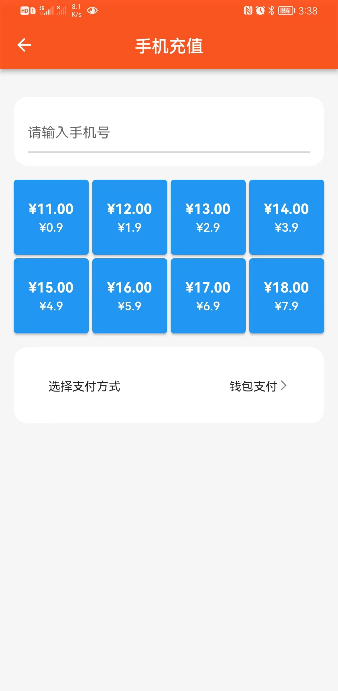
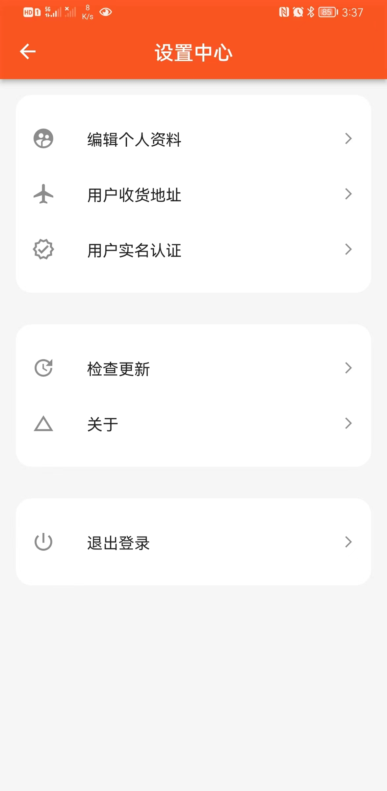
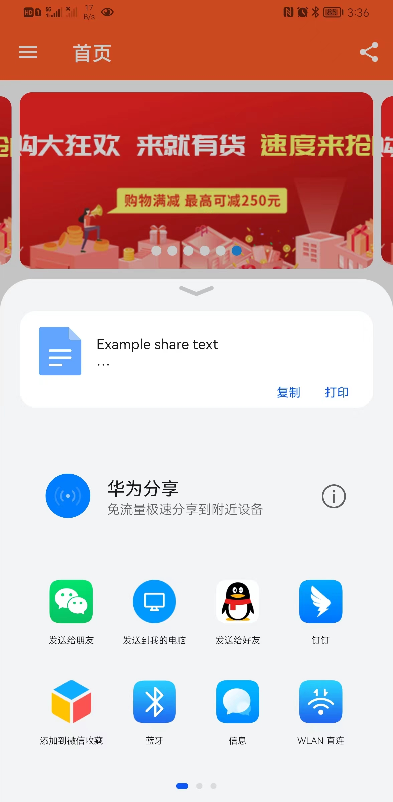

# mmgoods

A new Flutter project.

## 界面展示











## 生成语言文件

```bash
get generate locales ./lib/assets/locales
```

## 生成首屏加载页面

```bash
flutter pub run flutter_native_splash:create
```

## flutter_share

```swift
//ios/podfile
target 'Runner' do
    use_frameworks!
```
